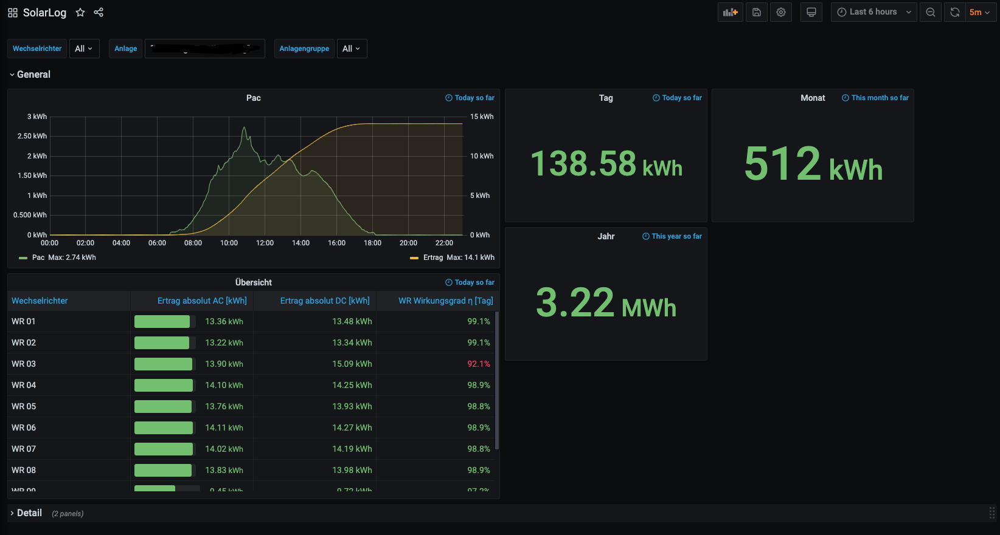

# SolarLog Exporter to InfluxDB
[](https://github.com/chrishrb/solarlog-exporter/actions/workflows/pipeline.yml)

This repository contains an exporter for SolarLog Monitoring Systems. The Script does the following operations:
1. Get data from LOCAL
2. Parse Config file
3. Parse min/daily files 
4. Add datapoints to influxDB

After that you can create fancy dashboards for grafana and monitor your PV-System. (my simple dashboard is in this repository under `docs/grafana.json`)



## Instructions:
1. Set Environment variables (more options under `solarlog_exporter/settings.py`:
    ```bash
    # SOLAR-LOG
    SOLAR_LOG_SYSTEM="PV-System"
   
    # INFLUXDB
    INFLUXDB_HOST=influxdb
    INFLUXDB_DB=solarlog
    ```
2. Start Docker containers: `docker-compose up -d`
3. Run Grafana, add influxdb as a new datasource and import the dashboard under `docs/grafana.json`

## Todo:
- secure influxdb with password
- add target value
- add actual value in percent
- add unit tests and github pipeline

## Important:
Use with caution! If you find any issues or improvements feel free to add pull requests or an issue!